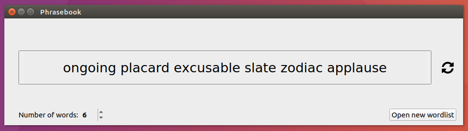

# phrasebook
### This is still very much in Alpha. Please don't use it to generate important passphrases.



Phrasebook is a program for generating secure passphrases from a word list. It's based off the idea behind the [EFF's diceware](https://www.eff.org/dice) and [XKCD #936](https://www.xkcd.com/936/).

It aims to support a few features often not present in similar programs:
- It provides a very simple graphical user interface instead of a
  command line interface.
- It allows for importing and using a custom wordlist of the user's choosing.
- It aims to provide default wordlists in languages other than just English.
- It allows for translations of the interface to make it accessible to
  non-English speakers.

Ease of uses and simplicity are strong design goals of the project.

## Developing on OSX/Linux
Install using the following commands. You must already have python, pip, and virtualenv installed and available on your path.
```
git clone https://github.com/simonft/phrasebook.git
cd phrasebook
virtualenv venv/
source venv/bin/activate
pip install -e .
```
You can now run phrasebook with the command `phrasebook`  while in the virtual environment.

## Helping with translations
phrasebook is currently only available in English. If you're
interested in helping translate please reach out.


## Wordlists
* [en.txt](phrasebook/wordlists/en.txt) was created by [SecureDrop](https://github.com/freedomofpress/securedrop/blob/develop/securedrop/wordlists/en.txt) and is licensed AGPLv3. It's based of a CC-BY list created be the [EFF](https://eff.org/wordlist).

## Icons
* The [refresh icon](phrasebook/images/sync-alt.svg) is from [Font Awesome](https://fontawesome.com/) and licensed CC-BY.
